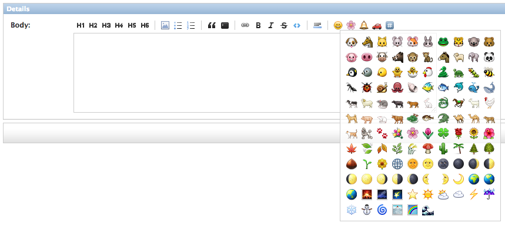

# django-emo

Emo is a Django app that enhances the [admin](https://docs.djangoproject.com/en/1.5/intro/tutorial02/) with a markdown WYSIWYG for textareas.


## Features

Emo uses the [markItUp](http://markitup.jaysalvat.com/home/) toolbar for adding [Markdown](http://daringfireball.net/projects/markdown/) to textareas. It uses a (mostly) unique skin to the toolbar that complements the minimalism of the admin.

The toolbar's [emoji](http://en.wikipedia.org/wiki/Emoji) use the Apple iOS emoji image set. Although emoji became a Unicode standard, some browsers (ahem, Chrome) still do not support the emoji HTML entities. Emo instead uses the [GitHub-flavored Markdown codes](http://www.emoji-cheat-sheet.com/) and a filter to replace the emoji text codes with their respective image equivalents.

Screenshot:




## Installation

Download django-emo, probably with [Pip](http://www.pip-installer.org/) via GitHub. Please replace `[virtualenvironment]` with your own. You can also git clone or download the tarball, but then remember to add the `emo` directory to your Python path.

```
pip install -e git+https://github.com/richardcornish/django-emo.git#egg=django-emo --src ~/.virtualenvs/[virtualenvironment]/lib/python2.7/site-packages
```

Add `emo` to `settings.py`'s `INSTALLED_APPS` tuple.

```
INSTALLED_APPS = {
    # ...
    'emo',
}
```

Append `class Media` parts to admin classes in each of your apps' `admin.py`. Example:

```
from django.contrib import admin
from ... import Post

class PostAdmin(admin.ModelAdmin):

    # ...

    class Media:
        css = {
            'all': ('emo/css/style.min.css',)
        }
        js = ('emo/js/alias.js', 'emo/js/markitup.js', 'emo/js/emo.js',)

admin.site.register(Post, PostAdmin)
```

Override the admin's `change_form.html` template for the app of your choosing.

```
# Inside /path/to/your/templates/admin/change_form.html




    {{ block.super }}
    <script>
        django.jQuery(function () {
            'use strict';
            Emo.addToolbar('#id_body'); // Selector of desired textarea
        });
    </script>

```

More at:

- [`ModelAdmin` media definitions](https://docs.djangoproject.com/en/dev/ref/contrib/admin/#modeladmin-media-definitions)
- [Overriding admin templates](https://docs.djangoproject.com/en/dev/ref/contrib/admin/#overriding-admin-templates)

Run `python manage.py collectstatic` in the correct django project directory and restart the server as necessary.


## Usage

Usage in a template after installation:

```


{{ post.body|emoji }}
```


## What else?

If there is an easier way to accomplish installation (perhaps avoiding `class Media`?), do let me know.

File an issue or pull request with ideas for things you would like to see.